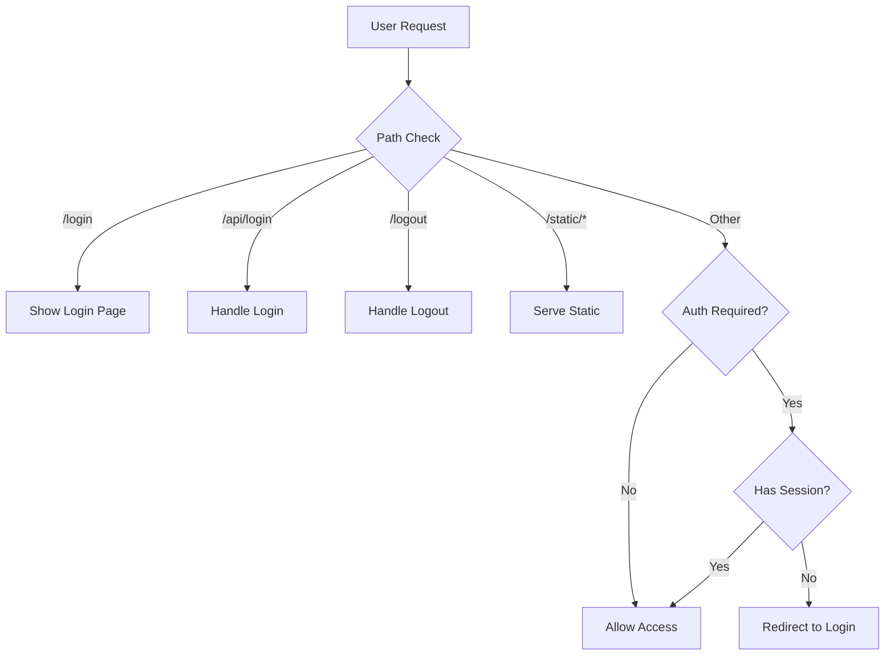

# Dashboard Authentication Documentation

## Table of Contents
- [Overview](#overview)
- [Architecture](#architecture)
- [Configuration](#configuration)
- [Authentication Flow](#authentication-flow)
- [Security Features](#security-features)
- [API Reference](#api-reference)
- [Examples](#examples)
- [Troubleshooting](#troubleshooting)

## Overview

The Loggerverse Dashboard provides a secure, web-based interface for viewing and managing application logs. When authentication is enabled, users must login with valid credentials before accessing the dashboard.

### Key Features
- **Multi-user Support**: Configure multiple users with different roles
- **Session Management**: Secure session-based authentication with configurable timeouts
- **Rate Limiting**: Protect against brute-force attacks
- **Role-Based Access**: Support for admin and viewer roles
- **Secure Cookies**: HttpOnly, SameSite cookies for security

## Architecture

### Components

```
┌─────────────────────────────────────────────────────────────┐
│                     Express/HTTP Server                      │
├─────────────────────────────────────────────────────────────┤
│                    Dashboard Middleware                       │
├─────────────────────────────────────────────────────────────┤
│  ┌──────────────┐  ┌──────────────┐  ┌──────────────┐      │
│  │Authentication│  │   Session    │  │  Rate Limit  │      │
│  │   Manager    │  │   Manager    │  │   Manager    │      │
│  └──────────────┘  └──────────────┘  └──────────────┘      │
├─────────────────────────────────────────────────────────────┤
│  ┌──────────────┐  ┌──────────────┐  ┌──────────────┐      │
│  │   Template   │  │     Log      │  │   Metrics    │      │
│  │   Renderer   │  │   Storage    │  │  Collector   │      │
│  └──────────────┘  └──────────────┘  └──────────────┘      │
└─────────────────────────────────────────────────────────────┘
```

### Request Flow

1. **Request arrives** at dashboard middleware
2. **Route detection** determines the requested resource
3. **Authentication check** verifies user session
4. **Authorization** ensures user has proper access
5. **Response** serves the requested resource or redirects

## Configuration

### Basic Configuration

```javascript
const logger = createLogger({
  dashboard: {
    enabled: true,
    path: '/logs',

    // Authentication configuration
    users: [
      {
        username: 'admin',
        password: 'securePassword123',
        role: 'admin'
      },
      {
        username: 'viewer',
        password: 'viewerPassword456',
        role: 'viewer'
      }
    ],

    // Session configuration
    sessionTimeout: 30, // minutes

    // Display configuration
    title: 'Application Logs',
    showMetrics: true,
    maxLogs: 1000
  }
});
```

### Configuration Options

| Option | Type | Default | Description |
|--------|------|---------|-------------|
| `enabled` | boolean | `false` | Enable/disable the dashboard |
| `path` | string | `'/logs'` | URL path for the dashboard |
| `users` | Array<User> | `[]` | Array of user credentials |
| `sessionTimeout` | number | `30` | Session timeout in minutes |
| `title` | string | `'Loggerverse Dashboard'` | Dashboard title |
| `showMetrics` | boolean | `true` | Show system metrics |
| `maxLogs` | number | `1000` | Maximum logs to keep in memory |
| `logFolder` | string | `'./logs'` | Folder for file-based logs |
| `realtime` | boolean | `true` | Enable real-time log streaming |

### User Configuration

```typescript
interface DashboardUser {
  username: string;    // Unique username
  password: string;    // Plain text password (will be hashed)
  role?: 'admin' | 'viewer';  // Optional role
}
```

## Authentication Flow

### 1. Initial Request



### 2. Login Process

```javascript
// POST /logs/api/login
{
  "username": "admin",
  "password": "admin123"
}

// Response (Success)
{
  "success": true,
  "redirect": "/logs",
  "username": "admin",
  "role": "admin"
}
// + Set-Cookie: dashboard_session=...

// Response (Failure)
{
  "error": "Invalid username or password",
  "attemptsRemaining": 4
}
```

### 3. Session Management

Sessions are managed server-side with the following properties:

```typescript
interface Session {
  id: string;           // Unique session ID
  username: string;     // User's username
  role?: string;        // User's role
  createdAt: number;    // Creation timestamp
  lastAccess: number;   // Last activity timestamp
}
```

## Security Features

### 1. Rate Limiting

Protects against brute-force attacks:

- **Maximum Attempts**: 5 login attempts per username/IP combination
- **Lockout Period**: 15 minutes after maximum attempts reached
- **Reset**: Successful login or timeout resets the counter

```javascript
// After 5 failed attempts
{
  "error": "Too many failed attempts. Please try again in 15 minutes."
}
```

### 2. Session Security

- **Secure Cookies**: HttpOnly, SameSite=Strict
- **Session Timeout**: Configurable, default 30 minutes
- **Automatic Cleanup**: Expired sessions are removed periodically
- **Session Invalidation**: Logout immediately invalidates the session

### 3. Password Security

- **No Plain Text Storage**: Passwords are never stored in plain text
- **Comparison Only**: Passwords are compared during authentication only
- **Input Validation**: Username and password format validation

### 4. CSRF Protection

- **SameSite Cookies**: Prevents CSRF attacks
- **HTTP Methods**: Proper HTTP method validation (POST for login)

## API Reference

### Routes

#### Public Routes (No Authentication Required)

| Route | Method | Description |
|-------|--------|-------------|
| `/logs/login` | GET | Display login page |
| `/logs/api/login` | POST | Handle login request |
| `/logs/static/*` | GET | Serve static resources |

#### Protected Routes (Authentication Required)

| Route | Method | Description |
|-------|--------|-------------|
| `/logs` | GET | Main dashboard |
| `/logs/api/logs` | GET | Fetch logs (JSON) |
| `/logs/api/metrics` | GET | Fetch system metrics |
| `/logs/api/stream` | GET | Real-time log stream (SSE) |
| `/logs/logout` | GET | Logout and clear session |

### Middleware Integration

```javascript
const express = require('express');
const { createLogger } = require('loggerverse');

const app = express();

const logger = createLogger({
  dashboard: {
    enabled: true,
    users: [
      { username: 'admin', password: 'admin123' }
    ]
  }
});

// Add dashboard middleware
app.use(logger.dashboard.middleware());
```

## Examples

### 1. Basic Authentication Setup

```javascript
const logger = createLogger({
  dashboard: {
    enabled: true,
    path: '/admin/logs',
    users: [
      {
        username: 'admin',
        password: process.env.ADMIN_PASSWORD || 'changeMe123',
        role: 'admin'
      }
    ],
    sessionTimeout: 60 // 1 hour
  }
});
```

### 2. Multiple Users with Roles

```javascript
const logger = createLogger({
  dashboard: {
    enabled: true,
    users: [
      { username: 'admin', password: 'admin123', role: 'admin' },
      { username: 'dev1', password: 'dev123', role: 'admin' },
      { username: 'support', password: 'support123', role: 'viewer' },
      { username: 'monitor', password: 'monitor123', role: 'viewer' }
    ]
  }
});
```

### 3. Custom Authentication Function

```javascript
const logger = createLogger({
  dashboard: {
    enabled: true,
    authenticate: async (req) => {
      // Custom authentication logic
      const token = req.headers.authorization;
      return await validateToken(token);
    }
  }
});
```

### 4. Production Configuration

```javascript
const logger = createLogger({
  dashboard: {
    enabled: process.env.NODE_ENV === 'production',
    path: process.env.DASHBOARD_PATH || '/secure-logs',
    users: JSON.parse(process.env.DASHBOARD_USERS || '[]'),
    sessionTimeout: parseInt(process.env.SESSION_TIMEOUT) || 30,
    maxLogs: 5000,
    showMetrics: true
  }
});
```

## Troubleshooting

### Common Issues

#### 1. Dashboard Shows Without Authentication

**Problem**: Users can access the dashboard without logging in.

**Solution**: Ensure users are configured:
```javascript
dashboard: {
  enabled: true,
  users: [  // This MUST be defined
    { username: 'admin', password: 'admin123' }
  ]
}
```

#### 2. "Too Many Failed Attempts" Error

**Problem**: Locked out after failed login attempts.

**Solution**:
- Wait 15 minutes for automatic reset
- Restart the server to clear rate limits
- Check username/password are correct

#### 3. Session Expires Too Quickly

**Problem**: Users are logged out frequently.

**Solution**: Increase session timeout:
```javascript
dashboard: {
  sessionTimeout: 120 // 2 hours
}
```

#### 4. Cannot Access Dashboard After Login

**Problem**: Login succeeds but dashboard redirects back to login.

**Possible Causes**:
- Cookies are disabled in browser
- Incorrect path configuration
- Session storage issue

**Solution**:
- Enable cookies in browser
- Check dashboard path configuration
- Verify session management is working

### Debug Mode

Enable debug logging to troubleshoot issues:

```javascript
const logger = createLogger({
  level: LogLevel.DEBUG,
  dashboard: {
    enabled: true,
    users: [...]
  }
});

// Debug information will be logged for:
// - Session creation/validation
// - Authentication attempts
// - Rate limiting events
```

## Best Practices

### 1. Secure Password Storage

**Never** commit passwords to version control:

```javascript
// BAD - Don't do this
users: [
  { username: 'admin', password: 'admin123' }
]

// GOOD - Use environment variables
users: [
  {
    username: process.env.ADMIN_USER,
    password: process.env.ADMIN_PASS
  }
]
```

### 2. HTTPS in Production

Always use HTTPS in production:

```javascript
// Ensure secure cookies in production
if (process.env.NODE_ENV === 'production') {
  app.use(forceSSL());
}
```

### 3. Strong Passwords

Enforce strong password requirements:
- Minimum 8 characters
- Mix of letters, numbers, special characters
- Regular password rotation

### 4. Session Management

- Use appropriate session timeouts
- Clear sessions on logout
- Monitor for suspicious activity

### 5. Rate Limiting

Adjust rate limiting based on your needs:

```javascript
// Custom rate limiting (future feature)
dashboard: {
  rateLimit: {
    maxAttempts: 3,
    windowMs: 30 * 60 * 1000 // 30 minutes
  }
}
```

## Migration Guide

### From No Authentication to Authentication

1. **Add users configuration**:
```javascript
// Before
dashboard: { enabled: true }

// After
dashboard: {
  enabled: true,
  users: [
    { username: 'admin', password: 'admin123' }
  ]
}
```

2. **Notify users** about the new authentication requirement
3. **Provide credentials** securely to authorized users
4. **Monitor** login attempts for issues

## Support

For issues or questions:
- GitHub Issues: [Report bugs or request features](https://github.com/yourusername/loggerverse/issues)
- Documentation: [Full documentation](https://github.com/yourusername/loggerverse/docs)
- Examples: [See examples folder](https://github.com/yourusername/loggerverse/examples)